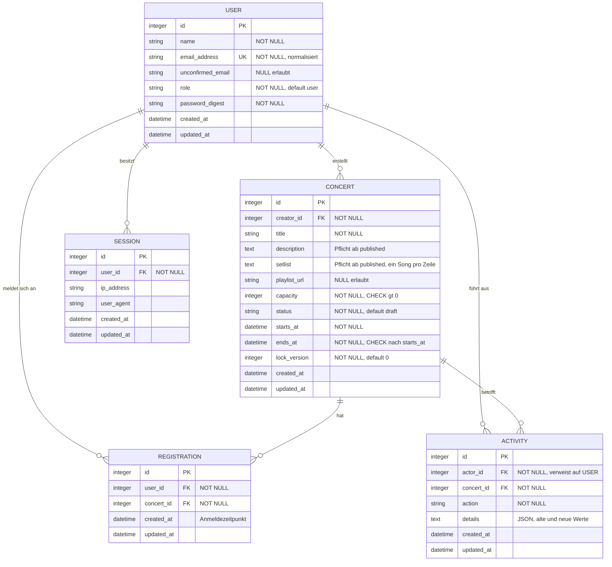
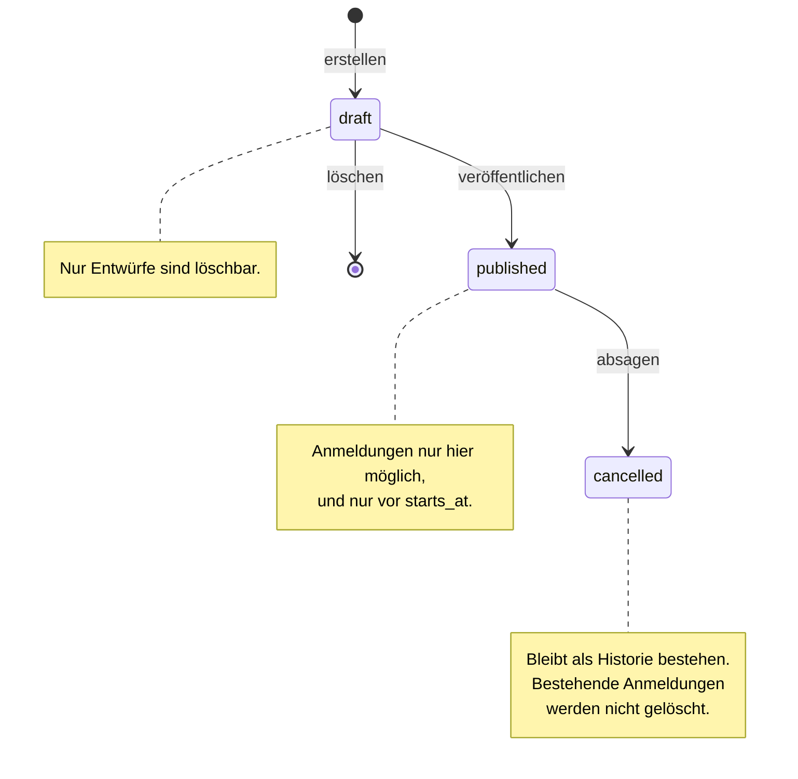

# EventDesk – Datenmodell

Technische Fassung des fachlichen Datenmodells aus dem Projektantrag, Abschnitt 4.

Dieses Dokument ist die **wartbare technische Fassung** des Datenmodells: Datentypen,
Constraints, Indizes und Nebenläufigkeit. Das ER-Diagramm für den Antrag wird daraus erzeugt.

**Fachlich massgebend bleibt der Projektantrag.** Dieses Dokument verfeinert ihn technisch,
es ersetzt ihn nicht. Ergibt sich beim Umsetzen eine fachliche Änderung gegenüber dem Antrag,
wird sie hier ausdrücklich als Änderung festgehalten und anschliessend im Antrag nachgezogen —
nicht stillschweigend übernommen.

Namens- und Sprachkonventionen: siehe `docs/spec/PROJECT.md`, Abschnitt „Conventions".
Kurzfassung: Entität heisst `Concert` (nie `Event`), Code englisch, UI deutsch.

---

## 1. Überblick



`SESSION` ist eine **technische** Tabelle des Rails-Authentication-Generators und gehört nicht
zum fachlichen Modell. Sie ist hier aufgeführt, damit das Diagramm dem tatsächlichen Schema
entspricht. Der Projektantrag hält das unter „Technische Daten für Sitzungen … werden bei der
Umsetzung ergänzt" offen.

---

## 2. Entitäten

### USER

Ein Benutzerkonto. Die Rolle steuert sämtliche Berechtigungen.

| Feld | Typ | Regel |
|---|---|---|
| `name` | string | Pflicht |
| `email_address` | string | Pflicht, **eindeutig**, klein geschrieben und getrimmt gespeichert |
| `unconfirmed_email` | string | optional; neu erfasste, noch nicht bestätigte Adresse |
| `role` | string | `user`, `organizer` oder `admin`; Standard `user` |
| `password_digest` | string | Pflicht; Klartext wird nie gespeichert, mindestens 12 Zeichen vor dem Hashen |

**E-Mail-Änderung:** Eine neue Adresse landet in `unconfirmed_email` und wird erst nach
Bestätigung nach `email_address` übernommen. Das gilt für die Selbstbedienung im Profil (S06)
**und** für die Änderung durch einen Admin (S13). Der Bestätigungslink ist ein signierter,
ablaufender Token aus dem Benutzerdatensatz (`generates_token_for :email_confirmation`) — es
gibt daher weder eine Token-Spalte noch eine Token-Tabelle.

### CONCERT

Ein Konzert mit begrenzter Kapazität. Zentrale Entität der Anwendung.

| Feld | Typ | Regel |
|---|---|---|
| `creator_id` | FK → USER | Pflicht; wer den Datensatz erstellt hat (Organisator *oder* Admin) |
| `title` | string | Pflicht |
| `description` | text | im Entwurf frei, ab `published` Pflicht (siehe unten) |
| `setlist` | text | im Entwurf frei, ab `published` Pflicht; ein Song pro Zeile in geplanter Reihenfolge |
| `playlist_url` | string | optional; öffnet eine externe Playlist |
| `capacity` | integer | Pflicht, grösser als 0, nie unter die aktuelle Belegung reduzierbar |
| `status` | string | `draft`, `published` oder `cancelled`; Standard `draft` |
| `starts_at` / `ends_at` | datetime | Pflicht; `ends_at` liegt nach `starts_at` |
| `lock_version` | integer | Optimistic Locking, Standard 0 |

#### Entscheidung: `description` und `setlist` sind statusabhängig Pflicht

Der Projektantrag beschreibt Konzerte durchgehend *mit* Beschreibung und Setlist (F02, S04),
bezeichnet aber ausdrücklich **nur** den Playlist-Link als optional. Für die übrigen beiden
Felder war damit offen, ob sie erzwungen werden. Entschieden wurde:

> Im Entwurf sind `description` und `setlist` frei. Zum Veröffentlichen sind beide erforderlich.

**Begründung:** Genau dafür existiert der Status `draft`. Ein Organisator soll ein Konzert
terminieren können, bevor das Programm feststeht — die Setlist entsteht typischerweise später.
Gleichzeitig darf kein veröffentlichtes Konzert ohne Beschreibung und Setlist erscheinen, weil
S04 beide als Inhalt der Detailseite vorsieht.

**Umsetzung:** keine `NOT NULL`-Constraints auf diesen beiden Spalten, sondern eine
statusabhängige Validierung im Model:

```ruby
validates :description, :setlist, presence: true, unless: :draft?
```

Die Bedingung lautet `unless: :draft?` und nicht `if: :published?`, damit die Felder auch bei
einem abgesagten Konzert nicht nachträglich geleert werden können. Ein Konzert, das den Status
verlässt, behält seine Pflichtangaben.

**Folge für die Oberfläche:** S10 muss beim Veröffentlichen eine Fehlermeldung anzeigen, wenn
eines der Felder leer ist, und die Eingaben dabei sichtbar lassen — dasselbe Verhalten wie beim
Locking-Konflikt.

**Folge für den Antrag:** F05 wird in Version 1.6 ergänzt. Siehe
`docs/Projektantrag-v1.6-Aenderungen.md`.

### REGISTRATION

Die Anmeldung eines Benutzers zu einem Konzert. Verbindet genau einen Benutzer mit genau
einem Konzert.

`created_at` ist fachlich der **Anmeldezeitpunkt** und wird in der Teilnehmerliste (S11)
angezeigt. Eine Stornierung **löscht** den Datensatz; es gibt kein Statusfeld.

### ACTIVITY

Protokolliert Aktionen an einem Konzert.

| `action` | ausgelöst durch |
|---|---|
| `registered` | Anmeldung zu einem Konzert |
| `cancelled_registration` | Stornierung einer Anmeldung |
| `published` | Veröffentlichung eines Konzerts |
| `updated` | Änderung eines **bereits veröffentlichten** Konzerts |
| `cancelled_concert` | Absage eines Konzerts |

`details` enthält bei `updated` die alten und neuen Werte der geänderten Felder.

Nicht protokolliert werden Änderungen an Entwürfen und an Benutzern — so im Projektantrag
festgelegt. `concert_id` ist deshalb Pflicht: jede Aktivität betrifft ein Konzert.

> ⚠️ Folge dieser Entscheidung: Eine **Rollenänderung durch einen Admin** ist nicht
> auditierbar. Soll sie protokolliert werden, muss `concert_id` NULL erlauben und der
> Projektantrag angepasst werden. Bewusst offen gelassen.

---

## 3. Constraints und Indizes

Die Projektregel lautet: kritische Datenregeln nicht nur im Model prüfen. Diese Tabelle hält
fest, was auf welcher Ebene abgesichert ist.

| Regel | Datenbank | Model |
|---|---|---|
| E-Mail eindeutig | `UNIQUE INDEX` auf `users.email_address` | `validates :email_address, uniqueness: true` |
| Eine Anmeldung pro Benutzer und Konzert | `UNIQUE INDEX` auf `registrations (user_id, concert_id)` | `validates :user_id, uniqueness: { scope: :concert_id }` |
| Kapazität positiv | `CHECK (capacity > 0)` | `validates :capacity, numericality: { greater_than: 0 }` |
| Ende nach Beginn | `CHECK (ends_at > starts_at)` | eigene Validierung |
| Gültige Rolle | `CHECK (role IN ('user','organizer','admin'))` | `enum` |
| Gültiger Status | `CHECK (status IN ('draft','published','cancelled'))` | `enum` |
| Pflichtfelder | `NOT NULL` | `presence: true` |
| Beschreibung und Setlist ab `published` | — bewusst kein Constraint, weil statusabhängig | `presence: true, unless: :draft?` |
| Referenzen gültig | `FOREIGN KEY` auf allen FK-Spalten | `belongs_to` (in Rails standardmässig Pflicht) |

Zusätzliche Indizes für Abfragen:

| Index | Zweck |
|---|---|
| `concerts (status, starts_at)` | Übersicht S03: kommende veröffentlichte Konzerte |
| `registrations (concert_id)` | Belegung zählen, Teilnehmerliste S11 |
| `registrations (user_id)` | Meine Anmeldungen S05 |
| `activities (created_at)` | Aktivitätsfeed S14, absteigend sortiert |
| `activities (concert_id)` | Aktivitäten eines Konzerts |

**Fremdschlüssel-Verhalten:** `registrations` und `activities` hängen an `concerts` und `users`.
Da nur Entwürfe löschbar sind und Entwürfe keine Anmeldungen haben können, entsteht im
Normalbetrieb kein Löschkonflikt. Benutzer werden nicht gelöscht.

---

## 4. Abgeleitete Werte

Nichts davon wird gespeichert — alles wird berechnet:

| Wert | Berechnung |
|---|---|
| Belegung | `concert.registrations.count` |
| Freie Plätze | `capacity - registrations.count` |
| Konzert voll | freie Plätze `<= 0` |
| Konzert begonnen | `starts_at <= Time.current` |

Ein Zählerfeld (`registrations_count`) wird **bewusst nicht** verwendet: es wäre ein zweiter
Ort für dieselbe Wahrheit und müsste bei jeder parallelen Buchung zusätzlich geschützt werden.

---

## 5. Konzert-Lebenszyklus



Bearbeiten, Veröffentlichen und Absagen sind nur **vor** `starts_at` möglich. Ein abgesagtes
Konzert kehrt nicht in einen früheren Status zurück.

---

## 6. Schutz gegen parallele Zugriffe

Zwei verschiedene Probleme mit zwei verschiedenen Lösungen — die Unterscheidung ist wichtig:

### Doppelanmeldung desselben Benutzers

Abgesichert durch den `UNIQUE INDEX` auf `(user_id, concert_id)`. Selbst wenn die
Model-Validierung umgangen wird oder zwei Requests gleichzeitig durchlaufen, kann der zweite
Datensatz nicht entstehen. Die Datenbank ist hier die letzte Instanz.

### Überbuchung durch verschiedene Benutzer

**Dafür gibt es keinen Constraint.** Zwei verschiedene Benutzer, die gleichzeitig den letzten
Platz buchen, erzeugen zwei unterschiedliche Zeilen — der UNIQUE-Index greift nicht. Der
Schutz liegt allein in der Transaktion:

```ruby
Concert.transaction do
  concert = Concert.find(id)          # frisch aus der DB, innerhalb der Transaktion
  raise Full if concert.registrations.count >= concert.capacity
  # ... Registration + Activity gemeinsam speichern
end
```

Der SQLite-Adapter von Rails 8.1 öffnet Transaktionen mit `BEGIN IMMEDIATE`. Schreibende
Transaktionen werden dadurch serialisiert: Die zweite Buchung wartet, bis die erste
abgeschlossen ist, und liest die Belegung danach neu. So wird der letzte Platz genau einmal
vergeben.

Voraussetzung ist `timeout: 5000` in `config/database.yml` — ohne diesen Wert würde die
zweite Transaktion sofort mit `SQLITE_BUSY` scheitern statt zu warten. Der Wert ist gesetzt.

Kapazitätsprüfung und Speichern müssen **innerhalb derselben Transaktion** liegen. Eine
Vorabprüfung ausserhalb ist wertlos, weil sich die Belegung bis zum Speichern ändern kann.

### Derselbe Schutz gilt für alle Operationen auf der Belegung

Der Projektantrag hält ausdrücklich fest: „Stornierungen, Kapazitätsänderungen und Absagen
verwenden denselben Schutz." Es genügt also **nicht**, nur die Buchung zu serialisieren.
Jede der folgenden Operationen liest den aktuellen Stand innerhalb derselben geschützten
Transaktion und schreibt erst danach:

| Operation | Warum sie geschützt gehört |
|---|---|
| Anmeldung | Belegung darf `capacity` nicht überschreiten |
| Stornierung | gibt einen Platz frei; parallele Buchung darf nicht auf einem veralteten Stand entscheiden |
| Kapazität ändern | neue `capacity` darf nicht unter die zum Zeitpunkt des Schreibens gültige Belegung fallen |
| Konzert absagen | Status und Belegung müssen gemeinsam konsistent bleiben, während parallel gebucht wird |

Der Fehlerfall, den das verhindert: Bei 80 Anmeldungen reduziert ein Organisator die Kapazität
von 100 auf 80, während gleichzeitig der 81. Platz gebucht wird. Ohne gemeinsame Serialisierung
prüft die Kapazitätsänderung gegen 80 Anmeldungen, die Buchung gegen ein Limit von 100 — und das
Konzert hat anschliessend 81 Anmeldungen bei 80 Plätzen, obwohl beide Operationen für sich
korrekt aussahen.

Praktisch heisst das: Diese vier Operationen laufen über denselben transaktionalen Pfad und
lesen `capacity` und die Anzahl Anmeldungen jeweils frisch innerhalb der Transaktion. Keine
davon wird als einfaches `update` ausserhalb einer Transaktion implementiert.

### Gleichzeitiges Bearbeiten eines Konzerts

`lock_version` (Optimistic Locking). Speichert ein Organisator eine veraltete Version, wirft
Rails `ActiveRecord::StaleObjectError`. Die Änderung wird abgewiesen, neuere Daten bleiben
erhalten, die Eingaben des Benutzers bleiben im Formular sichtbar und der aktuelle Stand kann
neu geladen werden (S10).

---

## 7. Transaktionsklammern

Diese Paare werden gemeinsam gespeichert oder gemeinsam verworfen:

| Fachliche Änderung | + Activity |
|---|---|
| Anmeldung | `registered` |
| Stornierung | `cancelled_registration` |
| Veröffentlichung | `published` |
| Änderung eines veröffentlichten Konzerts | `updated` |
| Absage | `cancelled_concert` |

Schlägt das Schreiben der Aktivität fehl, wird auch die fachliche Änderung zurückgerollt.
Genau das prüft der Rollback-Test in Aufgabe 8.

---

## 8. Verwendung für den Projektantrag

Für Version 1.6 des Antrags wird das Diagramm aus Abschnitt 1 gerendert und als Grafik
eingesetzt. Änderungsliste: `docs/Projektantrag-v1.6-Aenderungen.md`.

Rendern ohne zusätzliche Installation: das Diagramm auf <https://mermaid.live> einfügen und
als PNG oder SVG exportieren. GitHub und viele Markdown-Editoren stellen Mermaid direkt dar.

Für den Antrag genügt der fachliche Teil — `SESSION` kann in der Antragsgrafik entfallen,
weil der Antrag Sitzungsdaten ausdrücklich als technische Ergänzung behandelt.
