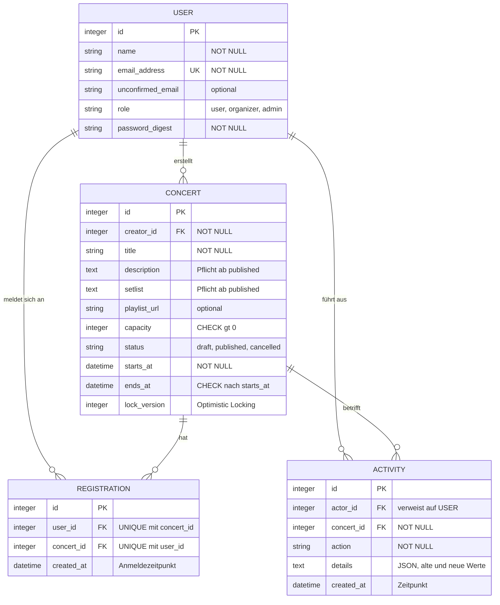
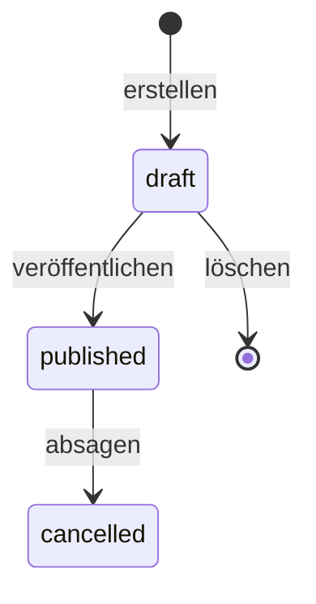
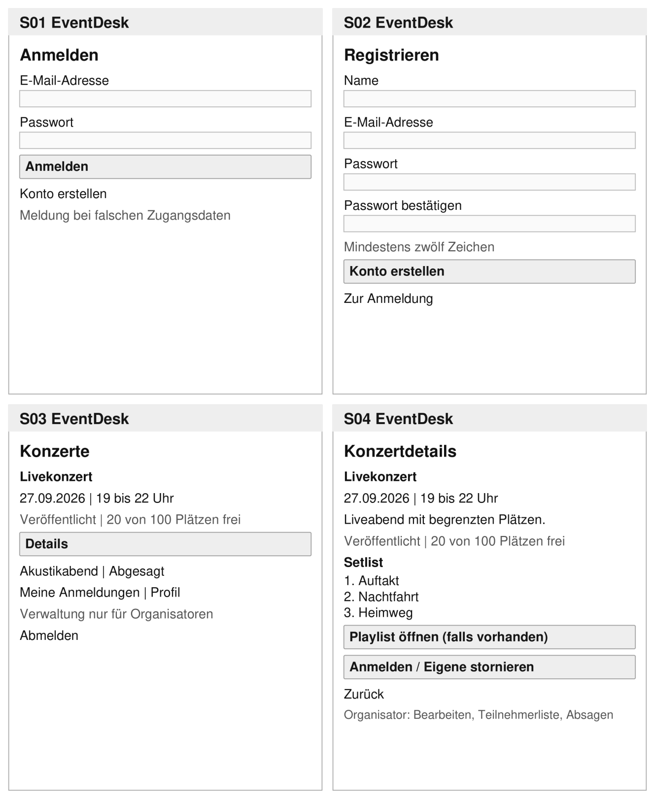
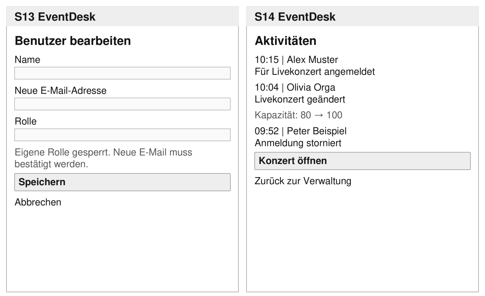

# Projektdokumentation EventDesk

**Konzertverwaltung und Anmeldung**
Modul 223: Multi-User-Applikationen objektorientiert realisieren

|         |             |
| ------- | ----------- |
| Autor   | Alex Uscata |
| Klasse  | INA-23A     |
| Kurs    | 24-223-E    |
| Datum   | 24.09.2026  |
| Version | 1.6         |
| Status  | Abgabe      |

EventDesk ermöglicht die Verwaltung von Konzerten mit begrenzten Plätzen und die Anmeldung dazu.
Konzertdetails enthalten eine Setlist und bei Bedarf einen Playlist-Link. Dieses Dokument ist
der genehmigte Projektantrag in der nachgeführten Fassung 1.6. Es beschreibt Anforderungen,
Konzept und Umsetzung und hält fest, was erreicht wurde und wie es geprüft ist.

### Versionen

| Version | Datum      | Änderung                                                                                                                                                                                                                                                                                                                      |
| ------- | ---------- | ----------------------------------------------------------------------------------------------------------------------------------------------------------------------------------------------------------------------------------------------------------------------------------------------------------------------------- |
| 1.5     | 18.09.2026 | Projektantrag zur Beurteilung                                                                                                                                                                                                                                                                                                 |
| 1.6     | 24.09.2026 | An die Umsetzung angeglichen: Entität `Event` in `Concert` umbenannt, Rollentabelle korrigiert, Benutzerverwaltung nur für Admins, Feld `unconfirmed_email` ergänzt, Pflichtangaben beim Veröffentlichen, Breadboards nachgeführt. Neu: Konventionen, Umsetzung, Prüfung der Anforderungen, erreichter Stand und Abweichungen |

Alle Änderungen gegenüber 1.5 sind in Abschnitt 11.2 mit Begründung aufgeführt.

---

## Inhalt

1. [Projektidee und Umfang](#1-projektidee-und-umfang)
2. [Konventionen](#2-konventionen)
3. [Anforderungen](#3-anforderungen)
4. [Rollen und Berechtigungen](#4-rollen-und-berechtigungen)
5. [Datenmodell](#5-datenmodell)
6. [Datenkonsistenz im Mehrbenutzerbetrieb](#6-datenkonsistenz-im-mehrbenutzerbetrieb)
7. [Breadboards](#7-breadboards)
8. [Wireframes](#8-wireframes)
9. [Umsetzung](#9-umsetzung)
10. [Tests und Prüfung der Anforderungen](#10-tests-und-prüfung-der-anforderungen)
11. [Erreichter Stand, Abweichungen und offene Punkte](#11-erreichter-stand-abweichungen-und-offene-punkte)
12. [Weitere Dokumente](#12-weitere-dokumente)

---

## 1. Projektidee und Umfang

### Problemstellung

Bei Konzerten mit begrenzter Kapazität müssen Anmeldungen und Stornierungen zuverlässig verwaltet
werden. Werden sie über einzelne Listen oder Nachrichten erfasst, müssen Organisatoren Änderungen
zusammenführen und freie Plätze nachzählen. Interessierte benötigen Konzertinformationen, eine
Setlist und gegebenenfalls einen Playlist-Link an einem Ort. Bei gleichzeitigen Anmeldungen darf
der letzte freie Platz nur einmal vergeben werden.

### Vision

EventDesk vereinfacht die Konzertverwaltung und die Anmeldung für Teilnehmende. Organisatoren
verwalten Konzerte, Teilnehmerlisten und Setlists. Die Anwendung verhindert, dass mehr Plätze
gebucht werden als verfügbar sind, auch wenn viele Personen gleichzeitig buchen.

### Erste Iteration

Die Kernfunktion ist die verbindliche Anmeldung zu einem Konzert. Ein Benutzer wählt ein Konzert
und meldet sich an. Die Anwendung prüft freie Plätze, Konzertstatus und eine bestehende Anmeldung.
Bei Erfolg werden Anmeldung und Aktivität gemeinsam gespeichert. Andernfalls erscheint eine
verständliche Fehlermeldung.

- Benutzerkonto mit Registrierung, Login, Profil, Passwortänderung und Bestätigung einer neuen
  E-Mail-Adresse
- Konzerte mit Details, Setlist, optionalem Playlist-Link, eigenen Anmeldungen und Stornierung
- Verwaltung von Konzerten und Teilnehmerlisten durch Organisatoren und Admins, Verwaltung von
  Benutzern und Rollen nur durch Admins
- Berechtigungen, Aktivitätsprotokoll und Tests der zentralen Regeln

### Abgrenzung und Technik

Wartelisten, Zahlungen, Kalenderintegration, QR-Codes, Uploads sowie Konzertbenachrichtigungen und
Erinnerungen sind nicht vorgesehen. Setlists werden als Text gepflegt. Ein Playlist-Link öffnet die
externe Playlist. Für die E-Mail-Bestätigung genügt ein Link im Entwicklungslog.

Die Umsetzung erfolgt mit Ruby on Rails 8.1, serverseitigen Ansichten, SQLite und Pundit. Die
Authentifizierung basiert auf dem Rails-Authentication-Generator, Registrierung und
E-Mail-Bestätigung sind ergänzt. Formulare werden für Erstellen und Bearbeiten wiederverwendet.

---

## 2. Konventionen

### Sprache

- **Code ist englisch:** Models, Attribute, Methoden, Routes, Controller, Policies, Tests,
  Kommentare und Commit-Messages.
- **Die Oberfläche ist deutsch:** Beschriftungen, Schaltflächen, Meldungen und Validierungsfehler.
  Alle Texte stehen in `config/locales/de.yml`, nicht fest im Code. Die Testumgebung bricht bei
  einer fehlenden Übersetzung ab, damit die Regel geprüft ist.
- **Rails-Konventionen:** Dateinamen, Ordner, REST-Routen und Tests folgen den Rails-Vorgaben.
  Statuswechsel sind eigene Ressourcen (`publication`, `cancellation`) statt zusätzlicher Aktionen
  auf dem Konzert-Controller. RuboCop prüft den Stil in der CI.

### Fachbegriffe

| Oberfläche (Deutsch)                     | Code (Englisch)                      |
| ---------------------------------------- | ------------------------------------ |
| Konzert                                  | `Concert`                            |
| Anmeldung (zu einem Konzert)             | `Registration`                       |
| Teilnehmer / Organisator / Administrator | Rolle `user` / `organizer` / `admin` |
| Ersteller                                | `creator`                            |
| Entwurf / Veröffentlicht / Abgesagt      | `draft` / `published` / `cancelled`  |
| Kapazität / Freie Plätze                 | `capacity` / `free_seats`            |
| Setlist / Playlist-Link                  | `setlist` / `playlist_url`           |
| Beginn / Ende                            | `starts_at` / `ends_at`              |
| Aktivität                                | `Activity`                           |

**Namensentscheidungen:** `Concert` statt `Event`, weil EventDesk ausschliesslich Konzerte verwaltet
und `Event` ein generischer Programmierbegriff ist. Der Produktname EventDesk bleibt. `Registration`
statt `Booking`, weil eine Anmeldung weder Zahlung noch Ticket noch Sitzplatz umfasst. `creator_id`
statt `organizer_id`, weil auch ein Admin ein Konzert erstellen kann.

**Begriffsabgrenzung:** „Anmelden" bedeutet sowohl Einloggen (`Session`) als auch die
Konzertanmeldung (`Registration`). „Stornieren" betrifft eine Anmeldung und löscht sie. „Absagen"
betrifft ein Konzert und setzt dessen Status auf `cancelled`, die Anmeldungen bleiben erhalten.

---

## 3. Anforderungen

P1 wird zuerst umgesetzt, P2 anschliessend. Beide Prioritäten gehören zum Umfang der ersten
Iteration.

### Funktionale Anforderungen

| ID  | Prio. | Anforderung                                                                                                                                                                                                                                                                                                                                                |
| --- | :---: | ---------------------------------------------------------------------------------------------------------------------------------------------------------------------------------------------------------------------------------------------------------------------------------------------------------------------------------------------------------- |
| F01 |  P1   | Benutzer können sich mit Name, eindeutiger E-Mail-Adresse und einem Passwort mit mindestens zwölf Zeichen registrieren sowie an- und abmelden.                                                                                                                                                                                                             |
| F02 |  P1   | Angemeldete Benutzer sehen kommende veröffentlichte und abgesagte Konzerte mit Beschreibung, Zeitraum, Status, freien Plätzen, Setlist und optionalem Playlist-Link. Mit eigener Anmeldung sind auch Details nach Konzertbeginn zugänglich.                                                                                                                |
| F03 |  P1   | Pro Benutzer ist eine Anmeldung pro zukünftigem, veröffentlichtem Konzert möglich. Volle Konzerte und doppelte Anmeldungen werden abgewiesen.                                                                                                                                                                                                              |
| F04 |  P1   | Benutzer sehen eigene Anmeldungen und können sie bei veröffentlichten Konzerten vor Beginn stornieren. Der Platz wird frei. Erneutes Anmelden ist bei freien Plätzen möglich.                                                                                                                                                                              |
| F05 |  P1   | Organisatoren und Admins erstellen und bearbeiten Konzerte mit Setlist und optionalem Playlist-Link. Sie können Entwürfe löschen, Konzerte veröffentlichen und veröffentlichte Konzerte absagen. Die Kapazität darf nicht unter der Belegung liegen. Beschreibung und Setlist sind zum Veröffentlichen erforderlich, im Entwurf dürfen sie noch leer sein. |
| F06 |  P2   | Organisatoren und Admins können die Teilnehmerliste eines Konzerts mit Name, E-Mail-Adresse und Anmeldezeitpunkt öffnen.                                                                                                                                                                                                                                   |
| F07 |  P1   | Benutzer können ihr eigenes Profil bearbeiten. Ein Passwortwechsel erfordert das aktuelle Passwort und mindestens zwölf Zeichen für das neue. Eine neue E-Mail-Adresse gilt erst nach Bestätigung.                                                                                                                                                         |
| F08 |  P1   | Administratoren sehen alle Benutzer und können deren Namen, E-Mail-Adressen und Rollen ändern. Ihre eigene Rolle dürfen sie nicht ändern. E-Mail-Änderungen erfordern die Bestätigung des betroffenen Benutzers.                                                                                                                                           |
| F09 |  P1   | Anmeldungen und Stornierungen werden protokolliert, ebenso Veröffentlichungen, Änderungen an veröffentlichten Konzerten und Absagen. Organisatoren und Admins sehen den Aktivitätsfeed.                                                                                                                                                                    |
| F10 |  P2   | Beim Speichern eines inzwischen veränderten Konzerts erscheint eine Konfliktmeldung. Neuere Daten werden nicht unbemerkt überschrieben.                                                                                                                                                                                                                    |

**Konzertregeln:** Die Kapazität ist positiv und das Ende liegt nach dem Beginn. Die Statusfolge
lautet Entwurf → veröffentlicht → abgesagt. Nur Entwürfe dürfen gelöscht werden. Bearbeiten,
Veröffentlichen und Absagen sind nur vor Beginn möglich. Abgesagte Konzerte und ihre Anmeldungen
bleiben unverändert als Historie erhalten. Beschreibung und Setlist müssen spätestens beim
Veröffentlichen vorhanden sein und können danach nicht mehr geleert werden.

### Qualitätsanforderungen

| ID  | Prio. | Überprüfbare Anforderung                                                                                                                                                                      |
| --- | :---: | --------------------------------------------------------------------------------------------------------------------------------------------------------------------------------------------- |
| Q01 |  P1   | Zwei gleichzeitige gültige Buchungsversuche verschiedener Benutzer für den letzten Platz ergeben genau eine Anmeldung. Pro Benutzer und Konzert existiert höchstens eine Anmeldung.           |
| Q02 |  P1   | Teilnehmende können auch durch direkte HTTP-Anfragen keine Konzerte oder Benutzer verwalten, fremde Anmeldungen stornieren oder Teilnehmerlisten und den Aktivitätsfeed öffnen.               |
| Q03 |  P1   | Anmeldung und Aktivität werden gemeinsam gespeichert. Scheitert eine der beiden Änderungen, bleibt keine davon bestehen.                                                                      |
| Q04 |  P2   | Bei vollen, abgesagten oder begonnenen Konzerten erscheint eine verständliche Fehlermeldung. Es wird keine Anmeldung gespeichert.                                                             |
| Q05 |  P2   | Pro erfolgreicher Aktion gemäss F09 entsteht genau eine Aktivität mit Benutzer, Konzert, Aktion und Zeitpunkt. Konzertänderungen enthalten in `details` zusätzlich die alten und neuen Werte. |

Wie jede Anforderung geprüft ist, steht in Abschnitt 10.

---

## 4. Rollen und Berechtigungen

| Rolle         | Berechtigungen                                                                                                                                           |
| ------------- | -------------------------------------------------------------------------------------------------------------------------------------------------------- |
| Teilnehmer    | Konzerte ansehen, sich selbst anmelden, eigene Anmeldungen stornieren und das eigene Profil bearbeiten                                                   |
| Organisator   | Zusätzlich Konzerte verwalten (erstellen, bearbeiten, Entwürfe löschen, veröffentlichen, absagen) sowie Teilnehmerlisten und den Aktivitätsfeed einsehen |
| Administrator | Zusätzlich Benutzer und Rollen verwalten                                                                                                                 |

Neue Konten erhalten die Rolle Teilnehmer. Ein erstes Adminkonto wird über die Startdaten
angelegt. Nur Admins dürfen die Rollen anderer Benutzer ändern, die eigene Rolle bleibt für alle
unveränderlich. Auch Organisatoren und Admins können sich für Konzerte anmelden.

Passwörter werden nur gehasht gespeichert (`has_secure_password`). Der Login schützt gegen
zeitbasierte Rückschlüsse auf bestehende Konten und sperrt nach zehn Versuchen innerhalb von drei
Minuten. E-Mail-Änderungen werden auch in der Benutzerverwaltung erst nach Bestätigung durch den
betroffenen Benutzer wirksam.

### Serverseitige Durchsetzung

Alle Berechtigungen prüft Pundit auf dem Server. Ausgeblendete Schaltflächen sind nur Komfort,
kein Schutz.

- Die Basis-Policy verweigert jede Aktion, solange eine Policy sie nicht ausdrücklich erlaubt.
- `after_action :verify_authorized` im `ApplicationController` meldet jede Controller-Aktion, die
  vergessen hat, `authorize` aufzurufen.
- Eine verweigerte Aktion führt zur Startseite mit der Meldung „Für diese Aktion fehlt dir die
  Berechtigung." Eine nicht gefundene Seite erhält ebenfalls eine Meldung mit Rückweg.
- Teilnehmer sehen Entwürfe nicht einmal in der Liste. Die Policy-Scope liefert ihnen nur
  veröffentlichte und abgesagte Konzerte, die noch nicht begonnen haben.

| Policy               | Wichtigste Regeln                                                                                                                                                                                                                                                    |
| -------------------- | -------------------------------------------------------------------------------------------------------------------------------------------------------------------------------------------------------------------------------------------------------------------- |
| `ConcertPolicy`      | Verwalten nur für Organisatoren und Admins. Bearbeiten nur vor Beginn und nicht nach Absage, Löschen nur für Entwürfe, Veröffentlichen nur für Entwürfe, Absagen nur für veröffentlichte Konzerte. Begonnene Konzerte sieht ein Teilnehmer nur mit eigener Anmeldung |
| `RegistrationPolicy` | Anmelden nur bei veröffentlichten, nicht begonnenen Konzerten. Stornieren nur die eigene Anmeldung und nur vor Beginn                                                                                                                                                |
| `ActivityPolicy`     | Feed nur für Organisatoren und Admins                                                                                                                                                                                                                                |
| `UserPolicy`         | Benutzerverwaltung nur für Admins, Rollenwechsel nie am eigenen Konto                                                                                                                                                                                                |

---

## 5. Datenmodell

Das fachliche Datenmodell besteht aus vier Entitäten. **Concert** steht für ein Konzert.
**Registration** verbindet Benutzer und Konzerte. **Activity** protokolliert die Aktionen eines
Benutzers an einem Konzert. **User** unterscheidet mit dem Feld `role` die drei Rollen.



Jede Entität besitzt eine eindeutige ID, Fremdschlüssel sichern die Beziehungen. Die Kombination
aus Benutzer und Konzert ist bei Anmeldungen eindeutig. Freie Plätze werden aus Kapazität minus
Anzahl Anmeldungen berechnet und nicht gespeichert: Ein Zählerfeld wäre ein zweiter Ort für
dieselbe Wahrheit und müsste bei parallelen Buchungen zusätzlich geschützt werden.

Setlist und Playlist-Link werden direkt am Konzert gespeichert. Die Setlist enthält einen Song pro
Zeile in geplanter Reihenfolge. `Activity.details` speichert bei Konzertänderungen die alten und
neuen Werte der geänderten Angaben. Stornierte Anmeldungen werden gelöscht. Nur Konzertentwürfe
sind löschbar.

Eine neu erfasste E-Mail-Adresse wird als `unconfirmed_email` gespeichert und erst nach Bestätigung
nach `email_address` übernommen. Der Bestätigungslink ist ein signierter, ablaufender Token
(`generates_token_for`) und benötigt keine eigene Tabelle. Für Sitzungen gibt es zusätzlich die
technische Tabelle `sessions` des Authentication-Generators. Sie gehört nicht zum fachlichen Modell.

### Absicherung in Datenbank und Model

Kritische Regeln sind nicht nur im Model, sondern auch in der Datenbank abgesichert:

| Regel                                        | Datenbank                                                | Model                                             |
| -------------------------------------------- | -------------------------------------------------------- | ------------------------------------------------- |
| E-Mail eindeutig                             | `UNIQUE INDEX` auf `users.email_address`                 | `uniqueness`                                      |
| Eine Anmeldung pro Benutzer und Konzert      | `UNIQUE INDEX` auf `registrations (user_id, concert_id)` | `uniqueness` mit `scope`                          |
| Kapazität positiv                            | `CHECK (capacity > 0)`                                   | `numericality`                                    |
| Ende nach Beginn                             | `CHECK (ends_at > starts_at)`                            | eigene Validierung                                |
| Gültige Rolle und gültiger Status            | `CHECK ... IN (...)`                                     | `enum`                                            |
| Pflichtfelder und Referenzen                 | `NOT NULL`, `FOREIGN KEY`                                | `presence`, `belongs_to`                          |
| Beschreibung und Setlist ab Veröffentlichung | bewusst kein Constraint, weil statusabhängig             | `presence: true, unless: :draft?`                 |
| Kapazität nicht unter Belegung               | kein Constraint möglich                                  | Validierung innerhalb der geschützten Transaktion |

### Lebenszyklus eines Konzerts



Anmeldungen sind nur im Status `published` und nur vor Beginn möglich. Ein abgesagtes Konzert
bleibt mit seinen Anmeldungen als Historie bestehen und kehrt nicht in einen früheren Status
zurück.

Die technische Fassung mit allen Indizes und Begründungen steht in `docs/datenmodell.md`.

---

## 6. Datenkonsistenz im Mehrbenutzerbetrieb

EventDesk muss zwei verschiedene Probleme lösen, und dafür braucht es zwei verschiedene Mittel.

### Doppelte Anmeldung desselben Benutzers

Der `UNIQUE INDEX` auf `(user_id, concert_id)` verhindert, dass derselbe Benutzer dasselbe Konzert
zweimal bucht, selbst wenn zwei Anfragen gleichzeitig durchlaufen. Schlägt der Index zu, zeigt die
Anwendung dieselbe Meldung wie bei der normalen Prüfung.

### Überbuchung durch verschiedene Benutzer

Hier greift der Index nicht: Zwei verschiedene Benutzer erzeugen zwei verschiedene Zeilen. Ohne
weiteren Schutz könnten beide gleichzeitig den letzten freien Platz sehen und beide speichern.

Deshalb liegen Kapazitätsprüfung und Speichern in derselben Transaktion. Der SQLite-Adapter von
Rails 8.1 öffnet Transaktionen mit `BEGIN IMMEDIATE`. Damit reserviert die Transaktion den
Schreibzugriff schon beim Start. Eine zweite Buchung wartet, bis die erste abgeschlossen ist, und
liest die Belegung erst danach. So wird der letzte Platz genau einmal vergeben.

```ruby
def register(user)
  registration = Registration.new(concert: self, user: user)

  protected_by_transaction do          # BEGIN IMMEDIATE, danach reload
    if !open_for_registration?
      registration.errors.add(:base, :closed)
    elsif registrations.exists?(user: user)
      registration.errors.add(:base, :duplicate)
    elsif full?
      registration.errors.add(:base, :full)
    else
      registration.save && log(user, :registered)
    end
  end

  registration
end
```

Drei Details sind dabei wichtig:

- **`reload` in der Transaktion:** Status und Belegung werden erst gelesen, wenn die Transaktion den
  Schreibzugriff hat. Eine Prüfung vor der Transaktion wäre wertlos, weil sich die Belegung bis zum
  Speichern ändern kann.
- **`uncached`:** Der Query-Cache von Rails könnte sonst eine Belegungszahl liefern, die vor einer
  parallelen Buchung gelesen wurde.
- **`timeout: 5000` in `config/database.yml`:** Die zweite Transaktion wartet bis zu fünf Sekunden
  auf die Sperre, statt sofort mit `SQLITE_BUSY` zu scheitern.

Denselben geschützten Pfad nutzen Stornierung, Veröffentlichung und Absage. Eine
Kapazitätsänderung prüft die Belegung als Validierung innerhalb ihrer Transaktion. Sonst könnte ein
Organisator bei 80 Anmeldungen die Kapazität von 100 auf 80 senken, während gleichzeitig der 81.
Platz gebucht wird. Die Änderung sähe 80 Anmeldungen, die Buchung die alte Kapazität 100. Beide
würden speichern, und das Konzert hätte 81 Anmeldungen bei 80 Plätzen.

### Transaktionen

Jede protokollierte Änderung und ihre Aktivität werden gemeinsam gespeichert oder gemeinsam
verworfen:

| Fachliche Änderung                       | Aktivität (`action`)                  |
| ---------------------------------------- | ------------------------------------- |
| Anmeldung                                | `registered`                          |
| Stornierung                              | `cancelled_registration`              |
| Veröffentlichung                         | `published`                           |
| Änderung eines veröffentlichten Konzerts | `updated`, mit alten und neuen Werten |
| Absage                                   | `cancelled_concert`                   |

Die Aktivität wird mit `create!` in der laufenden Transaktion geschrieben. Scheitert sie, wird auch
die fachliche Änderung zurückgerollt. Änderungen an Entwürfen und an Benutzern werden nicht
protokolliert, weil jede Aktivität ein Konzert betrifft.

### Gleichzeitiges Bearbeiten

Das Feld `lock_version` erkennt veraltete Konzertänderungen (Optimistic Locking). Hat ein anderer
Organisator oder Admin das Konzert inzwischen gespeichert, wirft Rails
`ActiveRecord::StaleObjectError`. Die Anwendung antwortet mit HTTP 409 und der Meldung „Dieses
Konzert wurde zwischenzeitlich geändert. Deine Eingaben wurden nicht gespeichert." Die Eingaben
bleiben im Formular sichtbar, und „Aktuellen Stand neu laden" holt die neuere Fassung.

Optimistic Locking passt hier besser als eine Sperre, weil Bearbeitungskonflikte selten sind und
ein Formular beliebig lange offen bleiben kann. Bei der Buchung dagegen ist der Konflikt der
Normalfall, darum wird dort pessimistisch serialisiert.

---

## 7. Breadboards

Die Orte S01 bis S14 entsprechen den Skizzen in Abschnitt 8. Aktionen führen zum angegebenen Ziel.
Bei ungültigen Eingaben oder unzulässigen Aktionen bleibt die aktuelle Seite mit einer Meldung
sichtbar. Passwortfelder werden geleert.

Jede Seite nach dem Login zeigt oben eine Navigation mit Konzerte (S03), Meine Anmeldungen (S05),
Profil (S06) und Abmelden. Organisatoren und Admins sehen zusätzlich Aktivitäten (S14), Admins
zusätzlich Benutzerverwaltung (S12).

### Teilnehmende

**S01 Anmelden**\
Eingabe: E-Mail und Passwort.
Anmelden → S03. Konto erstellen → S02.

**S02 Registrieren**\
Eingabe: Name, E-Mail, Passwort und Bestätigung.
Konto erstellen → S03. Zur Anmeldung → S01.

**S03 Konzerte**\
Anzeige: kommende Konzerte, Status und freie Plätze.
Details → S04. Meine Anmeldungen, Profil und Abmelden über die Navigation. Für Organisatoren und
Admins ist S03 zugleich S09.

**S04 Konzertdetails**\
Anzeige: Beschreibung, Zeitraum, Status, freie Plätze, Setlist und ein
vorhandener Playlist-Link.
Playlist öffnen → externe Playlist. Anmelden → S04 mit Bestätigung. Bei vollem, abgesagtem,
begonnenem oder bereits gebuchtem Konzert → Meldung auf S04. Eigene Anmeldung stornieren → S04,
nur vor Beginn bei veröffentlichtem Konzert. Zurück → S03.

**S05 Meine Anmeldungen**\
Anzeige: eigene Anmeldungen, auch vergangene und abgesagte Konzerte.
Details → S04, auch nach Konzertbeginn. Stornieren → S04 mit Bestätigung, nur vor Beginn bei
veröffentlichtem Konzert.

**S06 Mein Profil**\
Eingabe: Name. Anzeige: aktuelle und ausstehende E-Mail-Adresse, Rolle.
Speichern → S06 mit Bestätigung. E-Mail ändern → eigene Seite mit Eingabe der neuen Adresse,
danach S06 und Link im Entwicklungslog für S08. Passwort ändern → S07.

**S07 Passwort ändern**\
Eingabe: aktuelles Passwort, neues Passwort und Bestätigung.
Speichern oder abbrechen → S06.

**S08 E-Mail bestätigen**\
Einstieg über den Bestätigungslink.
Gültiger Link → Adresse ändern. Ungültiger Link → Meldung. Weiter → S06 mit Sitzung, sonst S01.

### Organisatoren und Admins

Teilnehmer erhalten bei einem direkten Zugriff auf diese Bereiche eine Meldung über fehlende
Berechtigungen.

**S09 Konzertverwaltung**\
S09 ist die Konzertliste S03 in der Ansicht für Organisatoren und
Admins. Anzeige: alle Konzerte, auch Entwürfe und vergangene.
Neues Konzert oder bearbeiten → S10. Konzert öffnen → S04. Aktivitäten → S14 und, nur für Admins,
Benutzerverwaltung → S12 über die Navigation.

**S10 Konzert erstellen oder ändern**\
Eingabe: Titel, Beschreibung, Beginn, Ende, Kapazität,
Setlist (ein Song pro Zeile) und optionaler Playlist-Link.
Speichern → S04. Ein neues Konzert ist zunächst ein Entwurf, veröffentlicht wird auf S04.
Ungültige Eingaben oder veraltete Version → Meldung auf S10. Aktuellen Stand laden → S10.
Abbrechen → S09 bei neuem Konzert, sonst S04.

**S04 Konzertdetails für Organisatoren**\
Aktionen nach Konzertstatus: Bearbeiten → S10.
Teilnehmerliste → S11. Entwurf veröffentlichen → S04. Entwurf löschen → S09. Veröffentlichtes
Konzert vor Beginn absagen → S04 mit Status abgesagt. Zurück → S09.

**S11 Teilnehmerliste**\
Anzeige: Name, E-Mail-Adresse und Anmeldezeitpunkt.
Zurück zum Konzert → S04.

**S14 Aktivitäten**\
Anzeige: Benutzer, Konzert, Aktion, Zeitpunkt und bei Konzertänderungen die
alten und neuen Werte der geänderten Angaben.
Konzert öffnen → S04.

### Administratoren

Admins nutzen zusätzlich die Benutzerverwaltung. Organisatoren und Teilnehmer erhalten bei einem
direkten Zugriff eine Meldung über fehlende Berechtigungen.

**S12 Benutzerverwaltung**\
Anzeige: alle Benutzer mit Name, E-Mail-Adresse und Rolle.
Bearbeiten → S13.

**S13 Benutzer bearbeiten**\
Eingabe: Name und Rolle, die eigene Rolle ist gesperrt. Die neue
E-Mail-Adresse hat ein eigenes Feld mit der Schaltfläche „Bestätigungslink senden".
Speichern oder abbrechen → S12. Eine neue E-Mail-Adresse benötigt die Bestätigung über S08 durch
den betroffenen Benutzer.

---

## 8. Wireframes

Die Skizzen zeigen die vorgesehenen Screens aus dem Projektantrag. Formulare werden für Erstellen
und Bearbeiten wiederverwendet. Hinweise auf Erfolg oder Fehler erscheinen auf der jeweiligen
Seite. Nicht verfügbare Aktionen werden ausgeblendet. Die Navigationsleiste und die Abweichungen aus
Abschnitt 7 sind in den Skizzen nicht nachgezeichnet.

### Anmeldung und Konzerte



### Profil und eigene Anmeldungen


### Verwaltung

In der Umsetzung ist S09 die Konzertliste mit zusätzlichen Aktionen für Organisatoren und Admins.


### Benutzer und Aktivitäten

Die Benutzerverwaltung (S12, S13) wird nur Admins angezeigt.



---

## 9. Umsetzung

### Aufbau

| Schicht    | Inhalt                                                                                                                                                                                       |
| ---------- | -------------------------------------------------------------------------------------------------------------------------------------------------------------------------------------------- |
| Models     | `User`, `Concert`, `Registration`, `Activity`. Die Fachregeln liegen im Model: `Concert#register`, `#publish`, `#cancel` und `#apply_changes` enthalten Prüfung, Transaktion und Protokoll   |
| Controller | Schlank: laden, `authorize`, Model-Methode aufrufen, Meldung setzen. Statuswechsel und Teilnehmerliste sind eigene Ressourcen unter `concerts/`, die Benutzerverwaltung liegt unter `admin/` |
| Policies   | Pundit, siehe Abschnitt 4                                                                                                                                                                    |
| Views      | Serverseitig gerendert, Formulare für Erstellen und Bearbeiten wiederverwendet, alle Texte aus `de.yml`                                                                                      |

### Fehlerbehandlung und Rückmeldungen

- Jede Aktion gibt eine deutsche Erfolgs- oder Fehlermeldung aus.
- Ungültige Formulare antworten mit HTTP 422, zeigen die Fehler gesammelt über dem Formular und
  behalten die Eingaben. Passwortfelder werden geleert.
- Ein Bearbeitungskonflikt antwortet mit HTTP 409, siehe Abschnitt 6.
- Eine Buchung, die nicht möglich ist, nennt den Grund: ausgebucht, bereits angemeldet, abgesagt
  oder bereits begonnen.
- Fehlende Berechtigungen und unbekannte Datensätze führen zu einer Meldung mit Rückweg, nie zu
  einer technischen Fehlerseite.
- Der Playlist-Link akzeptiert nur `http://` und `https://`, damit kein `javascript:`-Link auf der
  Detailseite landen kann.

### Starten

Installation, Demo-Konten und Testbefehl stehen im `README.md`. Kurzfassung:

```bash
bin/setup --skip-server   # Abhängigkeiten, Datenbank und Demodaten
bin/dev                   # Server auf http://localhost:3000
bin/rails test            # gesamte Testsuite
```

---

## 10. Tests und Prüfung der Anforderungen

### Testkonzept

Die Suite umfasst 253 Tests mit 807 Assertions in 25 Dateien, letzter Lauf ohne Fehler. Die CI auf
GitHub führt bei jedem Push die Tests, RuboCop, Brakeman, `bundler-audit` und `importmap audit` aus.

| Bereich          | Inhalt                                                                                                 |
| ---------------- | ------------------------------------------------------------------------------------------------------ |
| Model-Tests      | Validierungen, Beziehungen, Buchungs- und Statusregeln, Aktivitätsprotokoll, Rollback, Nebenläufigkeit |
| Controller-Tests | Echte Requests mit Login, erlaubten und verweigerten Zugriffen, Formularfehlern und Statuscodes        |
| Policy-Tests     | Die Policies als Objekte, erlaubte und verweigerte Aktionen je Rolle                                   |
| Mailer-Test      | Bestätigungsmail beim E-Mail-Wechsel                                                                   |

Berechtigungen werden als Request geprüft: Die Tests schicken den Request auch dann ab, wenn die
Oberfläche keine Schaltfläche dafür zeigt.

**Nebenläufigkeitstest:** `test/models/concert_concurrency_test.rb` lässt zwei Benutzer in zwei
Threads mit je eigener Datenbankverbindung gleichzeitig den letzten Platz buchen. Testtransaktionen
sind dafür abgeschaltet, und eine künstliche Verzögerung sorgt dafür, dass beide Versuche lesen,
bevor einer schreibt. Geprüft wird, dass genau ein Versuch gelingt und genau eine Anmeldung in der
Datenbank steht.

**Mutationsprobe:** Damit belegt ist, dass die Tests den Schutz wirklich prüfen, wurde der
Transaktionsschutz absichtlich entfernt. Danach scheitern beide Nebenläufigkeitstests, weil das
Konzert überbucht wird, sowie die Rollback-Tests. Wird die Kapazitätsprüfung selbst entfernt,
scheitern fünf Tests. Nach dem Zurücksetzen läuft die Suite wieder ohne Fehler.

### Prüfung der Anforderungen

| ID  | Automatisiert geprüft in                                                                                                        | Manuell (`testing.md` 7.1) | Ergebnis |
| --- | ------------------------------------------------------------------------------------------------------------------------------- | :------------------------: | :------: |
| F01 | `sessions_controller_test`, `users_controller_test`, `user_test`                                                                |           11, 18           | erfüllt  |
| F02 | `concerts_controller_test`, `concert_policy_test`                                                                               |            6, 7            | erfüllt  |
| F03 | `concert_test`, `registrations_controller_test`, `registration_test`                                                            |           8, 12            | erfüllt  |
| F04 | `registration_test`, `registrations_controller_test`                                                                            |             13             | erfüllt  |
| F05 | `concert_test`, `concerts_controller_test`, `publications_controller_test`, `cancellations_controller_test`                     |            4, 5            | erfüllt  |
| F06 | `participants_controller_test`, `concert_policy_test`                                                                           |             12             | erfüllt  |
| F07 | `profiles_controller_test`, `passwords_controller_test`, `email_changes_controller_test`, `email_confirmations_controller_test` |          1, 2, 3           | erfüllt  |
| F08 | `admin/users_controller_test`, `admin/email_changes_controller_test`, `user_policy_test`                                        |           16, 17           | erfüllt  |
| F09 | `activity_logging_test`, `activities_controller_test`                                                                           |             13             | erfüllt  |
| F10 | `concert_test`, `concerts_controller_test`                                                                                      |             15             | erfüllt  |
| Q01 | `concert_concurrency_test`, Unique Index in `registration_test`                                                                 |            keine           | erfüllt  |
| Q02 | Verweigerungstests in allen Controller-Tests, `policies/*_test`                                                                 |         9, 10, 17          | erfüllt  |
| Q03 | `activity_logging_test`: Rollback-Test je Transaktionsklammer                                                                   |            keine           | erfüllt  |
| Q04 | `concert_test`, `registrations_controller_test`                                                                                 |           8, 14            | erfüllt  |
| Q05 | `activity_logging_test`                                                                                                         |             13             | erfüllt  |

Die manuelle Prüfung der Abläufe über HTTP ist mit 18 von 18 Punkten erfüllt. Einzelheiten, der
Aufbau des Nebenläufigkeitstests und die Mutationsprobe stehen in `docs/testing.md`.

---

## 11. Erreichter Stand, Abweichungen und offene Punkte

### 11.1 Erreichter Stand

Umgesetzt sind alle funktionalen Anforderungen F01 bis F10 und alle Qualitätsanforderungen Q01 bis Q05:

- Registrierung, Login und Logout, Profil, Passwortwechsel mit aktuellem Passwort und
  E-Mail-Wechsel mit Bestätigungslink im Entwicklungslog
- Konzertliste und Konzertdetails mit Setlist und optionalem Playlist-Link
- Anmeldung und Stornierung, auch unter gleichzeitigen Zugriffen auf den letzten Platz
- Konzertverwaltung für Organisatoren und Admins: erstellen, bearbeiten, Entwürfe löschen,
  veröffentlichen und absagen, mit Konfliktmeldung bei veralteter Version
- Teilnehmerliste und Aktivitätsfeed für Organisatoren und Admins
- Benutzerverwaltung nur für Admins, die eigene Rolle bleibt gesperrt
- Berechtigungen serverseitig mit Pundit, Aktivitäten in derselben Transaktion wie die fachliche
  Änderung

### 11.2 Abweichungen vom Antrag 1.5

Diese Abweichungen sind in Version 1.6 bereits eingearbeitet.

| Antrag 1.5                                                          | Umsetzung                                                                                                | Grund                                                                                     |
| ------------------------------------------------------------------- | -------------------------------------------------------------------------------------------------------- | ----------------------------------------------------------------------------------------- |
| Entität `Event`, Fremdschlüssel `event_id`                          | `Concert`, `concert_id`                                                                                  | Domänenspezifischer Fachbegriff, `Event` ist generisch                                    |
| Rollentabelle: nur Admins verwalten Konzerte                        | Organisatoren und Admins verwalten Konzerte                                                              | F05, Breadboards und Wireframes verlangen es. Die Tabelle war die widersprüchliche Stelle |
| Abschnitt 1 und S12/S13: Organisatoren verwalten Benutzer           | Nur Admins verwalten Benutzer                                                                            | F08 und die Rollenregeln verlangen es                                                     |
| `USER` ohne Feld für die neue E-Mail-Adresse                        | Zusätzliches Feld `unconfirmed_email`                                                                    | Die Bestätigung braucht einen Ort für die ausstehende Adresse                             |
| Pflichtfelder offen                                                 | Beschreibung und Setlist sind ab dem Veröffentlichen Pflicht                                             | Entwürfe dürfen unvollständig sein, veröffentlichte Konzerte nicht                        |
| S09 als eigene Seite „Konzertverwaltung"                            | Die Konzertliste zeigt Organisatoren und Admins alle Konzerte mit Entwürfen und dem Link „Neues Konzert" | Eine zweite Liste mit fast gleichem Inhalt hätte keinen Mehrwert                          |
| „Zurück"-Links auf S05, S06, S09, S12 und S14                       | Feste Navigation oben auf jeder Seite                                                                    | Jeder Bereich ist von überall mit einem Klick erreichbar                                  |
| Anmelden und Stornieren führen zu S05 bzw. zur aktualisierten Liste | Beide führen zur Konzertdetailseite S04 mit Bestätigung                                                  | Die Meldung erscheint dort, wo sich freie Plätze und Status ändern                        |
| Neue E-Mail-Adresse direkt in S06 und S13                           | Eigenes Formular bzw. eigene Schaltfläche „Bestätigungslink senden"                                      | Namensänderung und E-Mail-Wechsel werden getrennt gespeichert und bestätigt               |
| S10: Entwurf speichern oder veröffentlichen                         | S10 speichert nur, veröffentlicht wird auf S04                                                           | Veröffentlichen ist ein eigener, protokollierter Schritt                                  |
| Keine Angabe zu Sitzungen                                           | Technische Tabelle `sessions` des Authentication-Generators                                              | Vom Antrag als technische Ergänzung vorgesehen                                            |

### 11.3 Offene Punkte und bewusste Grenzen

- **Sichtprüfung im Browser** (`docs/testing.md` 7.2): Die Abläufe sind über HTTP geprüft, die
  Darstellung im Browser wird vor der Präsentation durchgegangen.
- **Keine Systemtests im Browser:** Die Wegleitung verlangt sie nicht. Regeln und Berechtigungen
  sind über Model-, Policy- und Request-Tests abgedeckt.
- **Rollenänderungen werden nicht protokolliert:** Laut Antrag betrifft jede Aktivität ein Konzert.
  Eine Protokollierung von Benutzeränderungen wäre eine Erweiterung für eine nächste Iteration.
- **Kein echter E-Mail-Versand:** Wie im Antrag vorgesehen, steht der Bestätigungslink im
  Entwicklungslog.
- **Begonnene Konzerte** entstehen über die Oberfläche erst, wenn die Beginnzeit verstrichen ist.
  Die Meldung „Dieses Konzert hat bereits begonnen." ist deshalb nur automatisiert geprüft.

---

## 12. Weitere Dokumente

| Datei                                                  | Inhalt                                                                                 |
| ------------------------------------------------------ | -------------------------------------------------------------------------------------- |
| `README.md`                                            | Installation, Demo-Konten, Tests                                                       |
| `docs/datenmodell.md`                                  | Technische Fassung des Datenmodells: Datentypen, Constraints, Indizes, Nebenläufigkeit |
| `docs/testing.md`                                      | Testkonzept, Abdeckung, Nebenläufigkeitstest, Mutationsprobe, manuelle Prüflisten      |
| `docs/abgabe-stand.md`                                 | Stand bei der Abgabe mit allen Prüfergebnissen und CI-Korrekturen                      |
| `docs/Projektantrag_EventDesk_1-5-1.pdf`               | Genehmigter Projektantrag Version 1.5                                                  |
| `docs/Projektantrag-v1.6-Aenderungen.md`               | Arbeitsliste der Änderungen von 1.5 zu 1.6                                             |
| `docs/EventDesk_Projektuebersicht.md` und `docs/spec/` | Arbeitsgrundlage und Aufgabenspezifikationen aus der Umsetzung                         |

**Einsatz von KI:** Die Umsetzung erfolgte mit Unterstützung von Claude Code. Für jede der acht
Aufgaben wurde zuerst eine Spezifikation mit Akzeptanzkriterien erstellt und geprüft, erst danach
umgesetzt. Die Arbeitsgrundlage dafür ist `docs/EventDesk_Projektuebersicht.md`, die
Spezifikationen liegen in `docs/spec/`.
