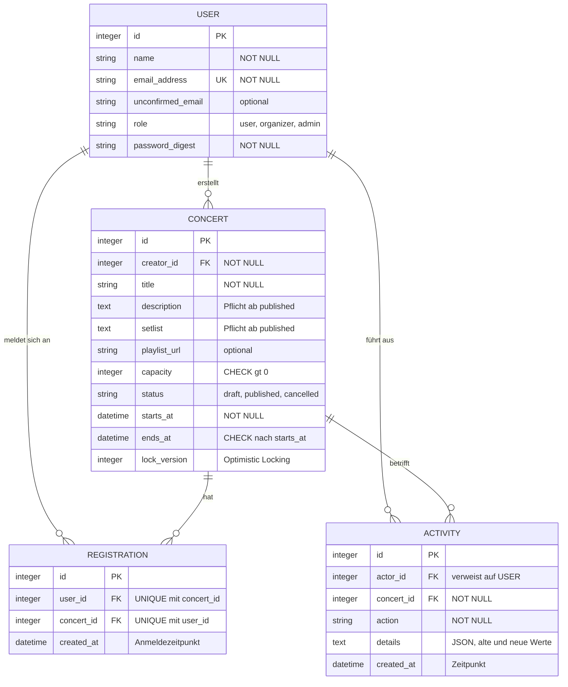
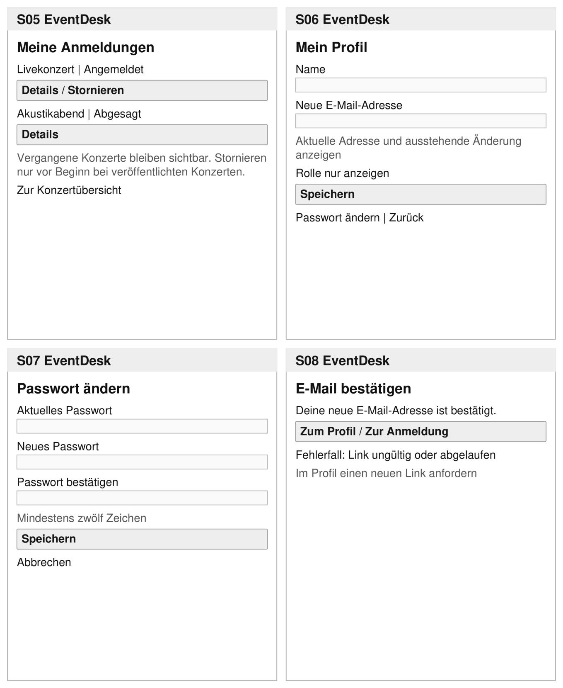
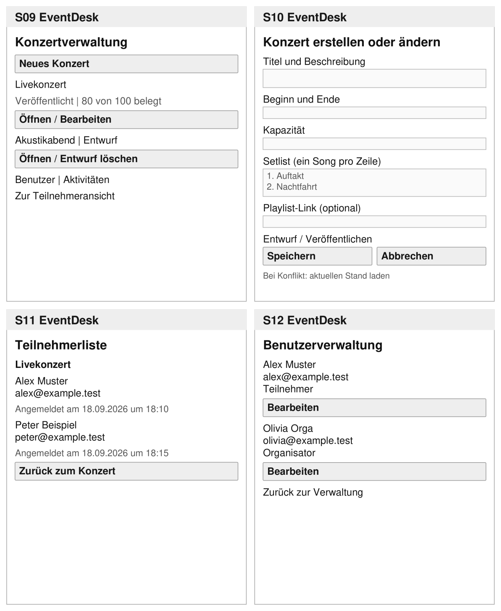

# Projektdokumentation EventDesk

**Konzertverwaltung und Anmeldung**
Modul 223: Multi-User-Applikationen objektorientiert realisieren

|         |             |
| ------- | ----------- |
| Autor   | Alex Uscata |
| Klasse  | INA-23A     |
| Kurs    | 24-223-E    |
| Datum   | 24.09.2026  |
| Version | 1.6         |
| Status  | Abgabe      |

EventDesk ermöglicht die Verwaltung von Konzerten mit begrenzten Plätzen und die Anmeldung dazu.
Dieses Dokument ist der genehmigte Projektantrag in der nachgeführten Fassung 1.6. Es beschreibt
Anforderungen, Konzept und Umsetzung und hält fest, was erreicht wurde und wie es geprüft ist.

### Versionen

| Version | Datum      | Änderung                                                                                                                                                                                                                                                                                                                      |
| ------- | ---------- | ----------------------------------------------------------------------------------------------------------------------------------------------------------------------------------------------------------------------------------------------------------------------------------------------------------------------------- |
| 1.5     | 18.09.2026 | Projektantrag zur Beurteilung                                                                                                                                                                                                                                                                                                 |
| 1.6     | 24.09.2026 | An die Umsetzung angeglichen: Entität `Event` in `Concert` umbenannt, Rollentabelle korrigiert, Benutzerverwaltung nur für Admins, Feld `unconfirmed_email` ergänzt, Pflichtangaben beim Veröffentlichen, Breadboards nachgeführt. Neu: Konventionen, Umsetzung, Prüfung der Anforderungen, erreichter Stand und Abweichungen |

Die Änderungen gegenüber 1.5 sind in Abschnitt 8 mit Begründung aufgeführt.

### Inhalt

1. [Projekt und Anforderungen](#1-projekt-und-anforderungen)
2. [Rollen und Berechtigungen](#2-rollen-und-berechtigungen)
3. [Datenmodell](#3-datenmodell)
4. [Datenkonsistenz im Mehrbenutzerbetrieb](#4-datenkonsistenz-im-mehrbenutzerbetrieb)
5. [Breadboards](#5-breadboards)
6. [Wireframes](#6-wireframes)
7. [Umsetzung und Tests](#7-umsetzung-und-tests)
8. [Erreichter Stand und Abweichungen](#8-erreichter-stand-und-abweichungen)

---

## 1. Projekt und Anforderungen

Bei Konzerten mit begrenzter Kapazität müssen Anmeldungen und Stornierungen zuverlässig verwaltet
werden. EventDesk bündelt Konzertinformationen, Setlist und Playlist-Link an einem Ort, lässt
Organisatoren Konzerte und Teilnehmerlisten verwalten und verhindert, dass mehr Plätze gebucht
werden als verfügbar sind, auch wenn viele Personen gleichzeitig buchen.

Die Kernfunktion ist die verbindliche Anmeldung zu einem Konzert. Die Anwendung prüft freie
Plätze, Konzertstatus und eine bestehende Anmeldung und speichert Anmeldung und Aktivität
gemeinsam. Wartelisten, Zahlungen, Kalenderintegration, QR-Codes, Uploads und Benachrichtigungen
sind nicht vorgesehen. Für die E-Mail-Bestätigung genügt ein Link im Entwicklungslog.

**Technik:** Ruby on Rails 8.1 mit serverseitigen Ansichten, SQLite und Pundit. Die
Authentifizierung basiert auf dem Rails-Authentication-Generator, ergänzt um Registrierung und
E-Mail-Bestätigung.

### Konventionen

Code, Tests und Commit-Messages sind englisch, die Oberfläche ist deutsch. Alle Texte stehen in
`config/locales/de.yml`, die Testumgebung bricht bei einer fehlenden Übersetzung ab.
Statuswechsel sind eigene REST-Ressourcen (`publication`, `cancellation`).

| Oberfläche                               | Code                                    |
| ---------------------------------------- | --------------------------------------- |
| Konzert / Anmeldung / Aktivität          | `Concert` / `Registration` / `Activity` |
| Teilnehmer / Organisator / Administrator | Rolle `user` / `organizer` / `admin`    |
| Entwurf / Veröffentlicht / Abgesagt      | `draft` / `published` / `cancelled`     |
| Kapazität / Freie Plätze                 | `capacity` / `free_seats`               |

`Concert` statt `Event`, weil EventDesk nur Konzerte verwaltet und `Event` ein generischer
Programmierbegriff ist. „Stornieren" löscht eine Anmeldung, „Absagen" setzt ein Konzert auf
`cancelled`, dessen Anmeldungen bleiben erhalten.

### Funktionale Anforderungen

P1 wird zuerst umgesetzt, P2 anschliessend. Beide gehören zum Umfang der ersten Iteration.

| ID  | Prio. | Anforderung                                                                                                                                                                                                                                                                                                                                                |
| --- | :---: | ---------------------------------------------------------------------------------------------------------------------------------------------------------------------------------------------------------------------------------------------------------------------------------------------------------------------------------------------------------- |
| F01 |  P1   | Benutzer können sich mit Name, eindeutiger E-Mail-Adresse und einem Passwort mit mindestens zwölf Zeichen registrieren sowie an- und abmelden.                                                                                                                                                                                                             |
| F02 |  P1   | Angemeldete Benutzer sehen kommende veröffentlichte und abgesagte Konzerte mit Beschreibung, Zeitraum, Status, freien Plätzen, Setlist und optionalem Playlist-Link. Mit eigener Anmeldung sind auch Details nach Konzertbeginn zugänglich.                                                                                                                |
| F03 |  P1   | Pro Benutzer ist eine Anmeldung pro zukünftigem, veröffentlichtem Konzert möglich. Volle Konzerte und doppelte Anmeldungen werden abgewiesen.                                                                                                                                                                                                              |
| F04 |  P1   | Benutzer sehen eigene Anmeldungen und können sie bei veröffentlichten Konzerten vor Beginn stornieren. Der Platz wird frei. Erneutes Anmelden ist bei freien Plätzen möglich.                                                                                                                                                                              |
| F05 |  P1   | Organisatoren und Admins erstellen und bearbeiten Konzerte mit Setlist und optionalem Playlist-Link. Sie können Entwürfe löschen, Konzerte veröffentlichen und veröffentlichte Konzerte absagen. Die Kapazität darf nicht unter der Belegung liegen. Beschreibung und Setlist sind zum Veröffentlichen erforderlich, im Entwurf dürfen sie noch leer sein. |
| F06 |  P2   | Organisatoren und Admins können die Teilnehmerliste eines Konzerts mit Name, E-Mail-Adresse und Anmeldezeitpunkt öffnen.                                                                                                                                                                                                                                   |
| F07 |  P1   | Benutzer können ihr eigenes Profil bearbeiten. Ein Passwortwechsel erfordert das aktuelle Passwort und mindestens zwölf Zeichen für das neue. Eine neue E-Mail-Adresse gilt erst nach Bestätigung.                                                                                                                                                         |
| F08 |  P1   | Administratoren sehen alle Benutzer und können deren Namen, E-Mail-Adressen und Rollen ändern. Ihre eigene Rolle dürfen sie nicht ändern. E-Mail-Änderungen erfordern die Bestätigung des betroffenen Benutzers.                                                                                                                                           |
| F09 |  P1   | Anmeldungen und Stornierungen werden protokolliert, ebenso Veröffentlichungen, Änderungen an veröffentlichten Konzerten und Absagen. Organisatoren und Admins sehen den Aktivitätsfeed.                                                                                                                                                                    |
| F10 |  P2   | Beim Speichern eines inzwischen veränderten Konzerts erscheint eine Konfliktmeldung. Neuere Daten werden nicht unbemerkt überschrieben.                                                                                                                                                                                                                    |

### Qualitätsanforderungen

| ID  | Prio. | Überprüfbare Anforderung                                                                                                                                                                      |
| --- | :---: | --------------------------------------------------------------------------------------------------------------------------------------------------------------------------------------------- |
| Q01 |  P1   | Zwei gleichzeitige gültige Buchungsversuche verschiedener Benutzer für den letzten Platz ergeben genau eine Anmeldung. Pro Benutzer und Konzert existiert höchstens eine Anmeldung.           |
| Q02 |  P1   | Teilnehmende können auch durch direkte HTTP-Anfragen keine Konzerte oder Benutzer verwalten, fremde Anmeldungen stornieren oder Teilnehmerlisten und den Aktivitätsfeed öffnen.               |
| Q03 |  P1   | Anmeldung und Aktivität werden gemeinsam gespeichert. Scheitert eine der beiden Änderungen, bleibt keine davon bestehen.                                                                      |
| Q04 |  P2   | Bei vollen, abgesagten oder begonnenen Konzerten erscheint eine verständliche Fehlermeldung. Es wird keine Anmeldung gespeichert.                                                             |
| Q05 |  P2   | Pro erfolgreicher Aktion gemäss F09 entsteht genau eine Aktivität mit Benutzer, Konzert, Aktion und Zeitpunkt. Konzertänderungen enthalten in `details` zusätzlich die alten und neuen Werte. |

---

## 2. Rollen und Berechtigungen

**Teilnehmer** sehen Konzerte, melden sich an, stornieren eigene Anmeldungen und bearbeiten ihr
Profil. **Organisatoren** verwalten zusätzlich Konzerte und sehen Teilnehmerlisten und den
Aktivitätsfeed. **Administratoren** verwalten zusätzlich Benutzer und Rollen. Neue Konten sind
Teilnehmer, das erste Adminkonto entsteht über die Startdaten. Die eigene Rolle kann niemand
ändern.

Alle Berechtigungen prüft Pundit auf dem Server, ausgeblendete Schaltflächen sind nur Komfort. Die
Basis-Policy verweigert jede Aktion, die nicht ausdrücklich erlaubt ist, und
`after_action :verify_authorized` meldet jede Controller-Aktion ohne `authorize`. Eine verweigerte
Aktion führt mit einer Meldung zur Startseite.

| Policy               | Wichtigste Regeln                                                                                                                                                                                                                                                                   |
| -------------------- | ----------------------------------------------------------------------------------------------------------------------------------------------------------------------------------------------------------------------------------------------------------------------------------- |
| `ConcertPolicy`      | Verwalten nur für Organisatoren und Admins. Bearbeiten nur vor Beginn und nicht nach Absage, Löschen nur für Entwürfe, Veröffentlichen nur für Entwürfe, Absagen nur für veröffentlichte Konzerte. Teilnehmer sehen keine Entwürfe und begonnene Konzerte nur mit eigener Anmeldung |
| `RegistrationPolicy` | Anmelden nur bei veröffentlichten, nicht begonnenen Konzerten. Stornieren nur die eigene Anmeldung und nur vor Beginn                                                                                                                                                               |
| `ActivityPolicy`     | Feed nur für Organisatoren und Admins                                                                                                                                                                                                                                               |
| `UserPolicy`         | Benutzerverwaltung nur für Admins, Rollenwechsel nie am eigenen Konto                                                                                                                                                                                                               |

Passwörter werden nur gehasht gespeichert (`has_secure_password`), der Login sperrt nach zehn
Versuchen innerhalb von drei Minuten.

---

## 3. Datenmodell

**Concert** ist ein Konzert, **Registration** verbindet Benutzer und Konzerte, **Activity**
protokolliert Aktionen an einem Konzert, und **User** unterscheidet mit `role` die drei Rollen.



Freie Plätze werden aus Kapazität minus Anzahl Anmeldungen berechnet und nicht gespeichert. Ein
Zählerfeld wäre ein zweiter Ort für dieselbe Wahrheit und müsste bei parallelen Buchungen
zusätzlich geschützt werden. Eine neue E-Mail-Adresse steht in `unconfirmed_email`, bis sie
bestätigt ist. Ein Konzert durchläuft die Status Entwurf → veröffentlicht → abgesagt. Nur Entwürfe
sind löschbar, abgesagte Konzerte bleiben mit ihren Anmeldungen als Historie erhalten.

Kritische Regeln sind nicht nur im Model, sondern auch in der Datenbank abgesichert:

| Regel                                        | Datenbank                                                | Model                                             |
| -------------------------------------------- | -------------------------------------------------------- | ------------------------------------------------- |
| E-Mail eindeutig                             | `UNIQUE INDEX` auf `users.email_address`                 | `uniqueness`                                      |
| Eine Anmeldung pro Benutzer und Konzert      | `UNIQUE INDEX` auf `registrations (user_id, concert_id)` | `uniqueness` mit `scope`                          |
| Kapazität positiv, Ende nach Beginn          | `CHECK`                                                  | `numericality`, eigene Validierung                |
| Gültige Rolle und gültiger Status            | `CHECK ... IN (...)`                                     | `enum`                                            |
| Beschreibung und Setlist ab Veröffentlichung | bewusst kein Constraint, weil statusabhängig             | `presence: true, unless: :draft?`                 |
| Kapazität nicht unter Belegung               | kein Constraint möglich                                  | Validierung innerhalb der geschützten Transaktion |

Die technische Fassung mit allen Indizes steht in `docs/datenmodell.md`.

---

## 4. Datenkonsistenz im Mehrbenutzerbetrieb

### Doppelte Anmeldung desselben Benutzers

Der `UNIQUE INDEX` auf `(user_id, concert_id)` verhindert, dass derselbe Benutzer ein Konzert
zweimal bucht, auch wenn zwei Anfragen gleichzeitig durchlaufen.

### Überbuchung durch verschiedene Benutzer

Hier greift der Index nicht, weil zwei Benutzer zwei verschiedene Zeilen erzeugen. Beide könnten
gleichzeitig den letzten freien Platz sehen und speichern. Deshalb liegen Kapazitätsprüfung und
Speichern in derselben Transaktion. Rails 8.1 öffnet SQLite-Transaktionen mit `BEGIN IMMEDIATE`,
die Transaktion reserviert also den Schreibzugriff schon beim Start. Eine zweite Buchung wartet
und liest die Belegung erst danach. So wird der letzte Platz genau einmal vergeben.

```ruby
def register(user)
  registration = Registration.new(concert: self, user: user)

  protected_by_transaction do          # BEGIN IMMEDIATE, danach reload
    if !open_for_registration?
      registration.errors.add(:base, :closed)
    elsif registrations.exists?(user: user)
      registration.errors.add(:base, :duplicate)
    elsif full?
      registration.errors.add(:base, :full)
    else
      registration.save && log(user, :registered)
    end
  end

  registration
end
```

- **`reload` in der Transaktion:** Status und Belegung werden erst gelesen, wenn die Transaktion
  den Schreibzugriff hat. Eine Prüfung davor wäre wertlos.
- **`uncached`:** Der Query-Cache könnte sonst eine veraltete Belegung liefern.
- **`timeout: 5000`:** Die zweite Transaktion wartet bis zu fünf Sekunden auf die Sperre, statt
  sofort mit `SQLITE_BUSY` zu scheitern.

Denselben geschützten Pfad nutzen Stornierung, Veröffentlichung, Absage und Kapazitätsänderung.
Sonst könnte ein Organisator die Kapazität auf die aktuelle Belegung senken, während
gleichzeitig ein weiterer Platz gebucht wird, und das Konzert wäre überbucht.

### Transaktionen

Anmeldung, Stornierung, Veröffentlichung, Änderung eines veröffentlichten Konzerts und Absage
schreiben ihre Aktivität mit `create!` in derselben Transaktion. Scheitert die Aktivität, wird auch
die fachliche Änderung zurückgerollt.

### Gleichzeitiges Bearbeiten

`lock_version` erkennt veraltete Konzertänderungen (Optimistic Locking). Hat jemand anderes das
Konzert inzwischen gespeichert, antwortet die Anwendung mit HTTP 409 und einer Konfliktmeldung. Die
Eingaben bleiben im Formular, „Aktuellen Stand neu laden" holt die neuere Fassung.

Optimistic Locking passt hier, weil Bearbeitungskonflikte selten sind und ein Formular beliebig
lange offen bleiben kann. Bei der Buchung ist der Konflikt dagegen der Normalfall, darum wird dort
pessimistisch serialisiert.

---

## 5. Breadboards

Die Orte S01 bis S14 entsprechen den Wireframes in Abschnitt 6. Bei ungültigen Eingaben oder
unzulässigen Aktionen bleibt die Seite mit einer Meldung sichtbar. Nach dem Login zeigt jede Seite
eine Navigation mit Konzerte (S03), Meine Anmeldungen (S05), Profil (S06) und Abmelden,
für Organisatoren und Admins zusätzlich Aktivitäten (S14), für Admins Benutzerverwaltung (S12).

### Teilnehmende

- **S01 Anmelden:** E-Mail, Passwort. Anmelden → S03, Konto erstellen → S02.
- **S02 Registrieren:** Name, E-Mail, Passwort, Bestätigung. Konto erstellen → S03.
- **S03 Konzerte:** kommende Konzerte mit Status und freien Plätzen. Details → S04.
- **S04 Konzertdetails:** Beschreibung, Zeitraum, Status, freie Plätze, Setlist, Playlist-Link.
  Anmelden oder stornieren → S04 mit Bestätigung. Für Organisatoren zusätzlich je nach Status:
  Bearbeiten → S10, Teilnehmerliste → S11, Veröffentlichen oder Absagen → S04, Entwurf löschen → S09.
- **S05 Meine Anmeldungen:** eigene Anmeldungen, auch vergangene. Details → S04.
- **S06 Mein Profil:** Name, E-Mail-Adressen, Rolle. E-Mail ändern → Link im Entwicklungslog für
  S08. Passwort ändern → S07.
- **S07 Passwort ändern:** aktuelles und neues Passwort. Speichern oder abbrechen → S06.
- **S08 E-Mail bestätigen:** über den Bestätigungslink. Weiter → S06, ohne Sitzung S01.

### Organisatoren und Admins

- **S09 Konzertverwaltung:** die Konzertliste S03 mit allen Konzerten inklusive Entwürfen. Neues
  Konzert → S10.
- **S10 Konzert erstellen oder ändern:** Titel, Beschreibung, Beginn, Ende, Kapazität, Setlist,
  Playlist-Link. Speichern → S04 (neue Konzerte als Entwurf). Veraltete Version → Meldung auf S10.
- **S11 Teilnehmerliste:** Name, E-Mail-Adresse, Anmeldezeitpunkt. Zurück → S04.
- **S14 Aktivitäten:** Benutzer, Konzert, Aktion, Zeitpunkt, geänderte Werte. Konzert → S04.
- **S12 Benutzerverwaltung** (nur Admins): alle Benutzer. Bearbeiten → S13.
- **S13 Benutzer bearbeiten** (nur Admins): Name, Rolle (eigene gesperrt), neue E-Mail mit
  „Bestätigungslink senden". Speichern → S12.

---

## 6. Wireframes

Die Skizzen zeigen die Screens aus dem Projektantrag. Die Navigationsleiste und die Abweichungen
aus Abschnitt 8 sind nicht nachgezeichnet.

### Anmeldung und Konzerte


### Profil und eigene Anmeldungen



### Verwaltung



### Benutzer und Aktivitäten


---

## 7. Umsetzung und Tests

### Aufbau

Die Fachregeln liegen im Model: `Concert#register`, `#publish`, `#cancel` und `#apply_changes`
enthalten Prüfung, Transaktion und Protokoll. Die Controller bleiben schlank: laden, `authorize`,
Model-Methode aufrufen, Meldung setzen. Ungültige Formulare antworten mit HTTP 422 und behalten
die Eingaben. Fehlende Berechtigungen und unbekannte Datensätze führen zu einer Meldung, nie zu
einer technischen Fehlerseite. Installation und Demo-Konten stehen im `README.md`.

### Testkonzept

Die Suite umfasst 256 Tests mit 819 Assertions (Model-, Controller-, Policy- und Mailer-Tests),
letzter Lauf ohne Fehler. Die CI führt bei jedem Push Tests, RuboCop, Brakeman, `bundler-audit`
und `importmap audit` aus. Berechtigungen werden als echter Request geprüft, auch wenn die
Oberfläche keine Schaltfläche dafür zeigt.

Der **Nebenläufigkeitstest** lässt zwei Benutzer in zwei Threads mit eigener Datenbankverbindung
gleichzeitig den letzten Platz buchen und prüft, dass genau eine Anmeldung entsteht. Bei der
**Mutationsprobe** wurde der Transaktionsschutz absichtlich entfernt, worauf die
Nebenläufigkeits- und Rollback-Tests scheiterten. Details stehen in `docs/testing.md`.

### Prüfung der Anforderungen

| ID  | Automatisiert geprüft in                                                                                                        | Manuell (`testing.md` 7.1) | Ergebnis |
| --- | ------------------------------------------------------------------------------------------------------------------------------- | :------------------------: | :------: |
| F01 | `sessions_controller_test`, `users_controller_test`, `user_test`                                                                |           11, 18           | erfüllt  |
| F02 | `concerts_controller_test`, `concert_policy_test`                                                                               |            6, 7            | erfüllt  |
| F03 | `concert_test`, `registrations_controller_test`, `registration_test`                                                            |           8, 12            | erfüllt  |
| F04 | `registration_test`, `registrations_controller_test`                                                                            |             13             | erfüllt  |
| F05 | `concert_test`, `concerts_controller_test`, `publications_controller_test`, `cancellations_controller_test`                     |            4, 5            | erfüllt  |
| F06 | `participants_controller_test`, `concert_policy_test`                                                                           |             12             | erfüllt  |
| F07 | `profiles_controller_test`, `passwords_controller_test`, `email_changes_controller_test`, `email_confirmations_controller_test` |          1, 2, 3           | erfüllt  |
| F08 | `admin/users_controller_test`, `admin/email_changes_controller_test`, `user_policy_test`                                        |           16, 17           | erfüllt  |
| F09 | `activity_logging_test`, `activities_controller_test`                                                                           |             13             | erfüllt  |
| F10 | `concert_test`, `concerts_controller_test`                                                                                      |             15             | erfüllt  |
| Q01 | `concert_concurrency_test`, Unique Index in `registration_test`                                                                 |           keine            | erfüllt  |
| Q02 | Verweigerungstests in allen Controller-Tests, `policies/*_test`                                                                 |         9, 10, 17          | erfüllt  |
| Q03 | `activity_logging_test`: Rollback-Test je Transaktionsklammer                                                                   |           keine            | erfüllt  |
| Q04 | `concert_test`, `registrations_controller_test`                                                                                 |           8, 14            | erfüllt  |
| Q05 | `activity_logging_test`, `registration_test`                                                                                    |             13             | erfüllt  |

Die manuelle Prüfung über HTTP ist mit 18 von 18 Punkten erfüllt.

---

## 8. Erreichter Stand und Abweichungen

Alle funktionalen Anforderungen F01 bis F10 und alle Qualitätsanforderungen Q01 bis Q05 sind
umgesetzt und geprüft (Abschnitt 7). Die folgenden Abweichungen vom Antrag 1.5 sind in dieser
Fassung bereits eingearbeitet:

| Antrag 1.5                                   | Umsetzung                                                 | Grund                                                                                     |
| -------------------------------------------- | --------------------------------------------------------- | ----------------------------------------------------------------------------------------- |
| Entität `Event`                              | `Concert`                                                 | Domänenspezifischer Fachbegriff, `Event` ist generisch                                    |
| Rollentabelle: nur Admins verwalten Konzerte | Organisatoren und Admins verwalten Konzerte               | F05, Breadboards und Wireframes verlangen es. Die Tabelle war die widersprüchliche Stelle |
| Organisatoren verwalten Benutzer             | Nur Admins verwalten Benutzer                             | F08 und die Rollenregeln verlangen es                                                     |
| Kein Feld für die neue E-Mail-Adresse        | Zusätzliches Feld `unconfirmed_email`                     | Die Bestätigung braucht einen Ort für die ausstehende Adresse                             |
| Pflichtfelder offen                          | Beschreibung und Setlist ab dem Veröffentlichen Pflicht   | Entwürfe dürfen unvollständig sein, veröffentlichte Konzerte nicht                        |
| S09 als eigene Seite                         | Konzertliste zeigt Organisatoren zusätzlich alle Entwürfe | Eine zweite Liste mit fast gleichem Inhalt hätte keinen Mehrwert                          |
| „Zurück"-Links auf mehreren Seiten           | Feste Navigation oben auf jeder Seite                     | Jeder Bereich ist von überall mit einem Klick erreichbar                                  |
| S10: Entwurf speichern oder veröffentlichen  | S10 speichert nur, veröffentlicht wird auf S04            | Veröffentlichen ist ein eigener, protokollierter Schritt                                  |

### Offene Punkte und bewusste Grenzen

- **Sichtprüfung im Browser** (`docs/testing.md` 7.2) wird vor der Präsentation durchgegangen.
  Systemtests im Browser verlangt die Wegleitung nicht.
- **Rollenänderungen werden nicht protokolliert**, weil laut Antrag jede Aktivität ein Konzert
  betrifft. Das wäre eine Erweiterung für eine nächste Iteration.
- **Kein echter E-Mail-Versand:** Wie vorgesehen steht der Bestätigungslink im Entwicklungslog.

### Weitere Dokumente und Einsatz von KI

Das technische Datenmodell steht in `docs/datenmodell.md`, Testkonzept und Prüflisten in
`docs/testing.md`, der genehmigte Antrag 1.5 in `docs/Projektantrag_EventDesk_1-5.pdf`. Die
Umsetzung erfolgte mit Unterstützung von Claude Code. Für jede der acht Aufgaben wurde zuerst eine
Spezifikation mit Akzeptanzkriterien erstellt und geprüft, erst danach umgesetzt (`docs/spec/`).
